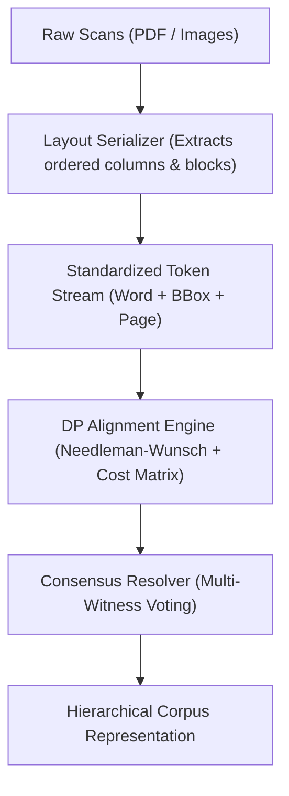

# Strategic Architectural Review & Next-Gen Sefer Digitization Design

> **Context:** Comprehensive 20-commit evaluation (`318f27c` $\rightarrow$ `f23cd63`) of the `sefer-digitization-pipeline` codebase, synthesizing architectural audits, failure modes of the current "patch mentality", a Next-Gen proposal, and a mathematically rigorous second-opinion critique.

---

## 1. Executive Synthesis: The Two Perspectives

```
┌───────────────────────────────────────────────────────────────────────────────────┐
│                          THE CORE ARCHITECTURAL DEBATE                            │
├─────────────────────────────────────────┬─────────────────────────────────────────┤
│    PROPOSAL A: Massive Next-Gen Engine  │   PROPOSAL B: The Minimal Elegant Kernel│
├─────────────────────────────────────────┼─────────────────────────────────────────┤
│ • Full URCS Graph Model (Talmud/Daf)    │ • Strict Linear Hierarchy (Book/Sec/Tok)│
│ • Consensus DAG with Neural Embeddings  │ • Needleman-Wunsch DP + Cost Matrix     │
│ • Dynamic Layout Intelligence Framework │ • Decoupled Layout Serializer           │
│ • Active Learning & Bayesian LM Scoring │ • Deterministic Multi-Sequence Alignment│
│ ⚠️ Risk: Second-System Over-Engineering │ 🎯 Advantage: Provably Correct & Lean   │
└─────────────────────────────────────────┴─────────────────────────────────────────┘
```

Both models agree on the diagnosis: **The current codebase is bogged down by a fragile "patchwork mentality"** (greedy `difflib` string diffs, manual `CONFUSION_PAIRS` whack-a-mole, hardcoded magic strips like `MARKER_X_BAND = (0.80, 0.93)`, and loss-masking test baselines).

The path forward is **not** to build a sprawling, over-engineered layout graph framework, but to replace the fragile heuristics with a **mathematically provable, lean Dynamic Programming alignment kernel** and clean separation of concerns.

---

## 2. Deep Audit of the 20-Commit Trajectory (`318f27c` $\rightarrow$ `f23cd63`)

### A. Root-Cause Vulnerabilities & Leaky Abstractions
1. **The Monotonic Cursor Trap (`build_gematria_trace.py`)**:
   - Assumes sequential, monotonic discovery of marginal markers.
   - When a single marker is missing or merged by DocAI (e.g. Klal 10), the bounding cursor desynchronizes all subsequent sections.
2. **Brittle Vertical Clustering (`build_klal_page_regions.py`)**:
   - Clusters lines using raw coordinate thresholds (`LINE_TOL = 0.008`).
   - Fails under slight page rotation, scanner skew, or font-size shifts between commentary and main text.
3. **Loss-Masking Test Invariants (`test_corpus_invariants.py`)**:
   - `SPAN_COVERAGE_BASELINE` and `DUPLICATE_WORD_BASELINE` hardcode exceptions to silence test failures instead of solving the structural cause of truncated spans.

### B. Patchwork Anti-Patterns Catalog

| Heuristic / Anti-Pattern | Location in Code | Why It Fails Systemically |
|---|---|---|
| **Magic Margin Bands** | `MARKER_X_BAND = (0.80, 0.93)` | Hardcoded to single-column right margins; breaks on two-column pages or alternate folios. |
| **Manual `CONFUSION_PAIRS`** | `build_gematria_trace.py`, `detect_real_word_substitution.py` | Hand-curated character substitution lists (`ט↔פ`, `ז↔ו`, `ד↔ר`). Infinite manual maintenance. |
| **Magic Lookaheads & Ratios** | `CONTENT_WORDS = 8`, `OK_RATIO = 0.60`, `MIN_REPLACE_SIMILARITY = 0.5` | Ad-hoc threshold constants that fail on short headings or dense passages. |
| **Greedy Character Diffing** | `difflib.SequenceMatcher` across all tools | Ratcliff/Obershelp greedy matching creates catastrophic phase shifts on optical character substitutions. |

---

## 3. The Minimal Elegant Kernel (The Second-Opinion Consensus)

Instead of complex DAG engines or heavy neural embeddings, the multi-witness OCR problem reduces to a classic, provably optimal computer science problem: **Multiple Sequence Alignment (MSA) with a Domain-Specific Substitution Cost Matrix**.

```
                MULTI-WITNESS NEEDLEMAN-WUNSCH ALIGNMENT
                
   Corpus Token Stream:  ──► [ורש"י] ──► [כתב] ──► [בססחים] ──► [כ"ד]
                                │          │          │          │
   Hebrew Cost Matrix:          │ Cost=0   │ Cost=0   │ Cost=0.1 │ Cost=0  (ס↔פ low penalty)
                                ▼          ▼          ▼          ▼
   DocAI Token Stream:   ──► [ורש"י] ──► [כתב] ──► [בפסחים] ──► [כ"ד]
                                │          │          │          │
   Hebrew Cost Matrix:          │ Cost=0   │ Cost=0   │ Cost=0   │ Cost=0
                                ▼          ▼          ▼          ▼
   VLM Token Stream:     ──► [ורש"י] ──► [כתב] ──► [בפסחים] ──► [כ"ד]
   
   ════════════════════════════════════════════════════════════════════════════
   GLOBAL OPTIMAL CONSENSUS: [ורש"י] [כתב] [בפסחים] (P=0.999) [כ"ד]
```

### 1. The Declarative Hebrew Substitution Cost Matrix
Instead of hand-picking `CONFUSION_PAIRS` in discrete lists, we define a static, continuous penalty matrix $\mathcal{M}(c_1, c_2) \in [0, 1]$:
* $\mathcal{M}(c, c) = 0.0$ (Exact match)
* $\mathcal{M}(\text{ס}, \text{פ}) = 0.1$ (High optical similarity)
* $\mathcal{M}(\text{ו}, \text{ן}) = 0.1$ / $\mathcal{M}(\text{ד}, \text{ר}) = 0.1$ / $\mathcal{M}(\text{ט}, \text{פ}) = 0.15$
* $\mathcal{M}(\text{א}, \text{מ}) = 0.9$ (Unrelated glyphs)
* $\mathcal{M}(\text{char}, \emptyset) = 0.5$ (Insertion / Deletion penalty)

### 2. Needleman-Wunsch / Hirschberg Alignment Engine
* Computes the global minimum-cost alignment between OCR witnesses in $O(N \cdot M)$ time and $O(\min(N, M))$ space.
* Eliminates greedy phase shifts: optical letter confusions are aligned naturally with minimal penalty rather than treated as deletions/insertions.

### 3. Progressive 3-Way Witness Consensus
* Align Witness 1 (DocAI) $\leftrightarrow$ Witness 2 (VLM Pass A).
* Form consensus profile and align Witness 3 (VLM Pass B / Dicta).
* Disagreements naturally surface where consensus confidence falls below threshold—zero manual heuristic code required.

---

## 4. Pragmatic Generalizability: Decoupled Data Model

To ensure the engine works out of the box for any Rabbinic text (Responsa, Shulchan Aruch, commentaries, single or multi-column folios) without bloated layout graphs:



### Standardized Linear Corpus Schema
Decouple physical layout geometry from logical reading order:
```json
{
  "work": "Yad Malachi",
  "volume": 1,
  "sections": [
    {
      "section_id": 16,
      "heading": "טז",
      "tokens": [
        { "text": "כתב", "page": 19, "bbox": [0.857, 0.743, 0.910, 0.758], "witnesses": { "docai": "פז", "vlm": "כתב" } }
      ]
    }
  ]
}
```

---

## 5. Proposed Actionable Roadmap

1. **Step 1: Core Alignment Kernel (Replace `difflib`)**
   - Implement `hebrew_dp_aligner.py` using Needleman-Wunsch and a declarative character confusion cost matrix.
   - Verify that all existing alignment benchmarks match or exceed current accuracy without brittle constants.
2. **Step 2: Universal Witness Ingestion**
   - Standardize witness outputs (DocAI, VLM Pass A, VLM Pass B) into uniform token streams.
   - Run 3-way progressive alignment to generate the consensus dispute pool automatically.
3. **Step 3: Decoupled Layout Serialization**
   - Generalize page region extraction so that column boundaries and line ordering are computed dynamically per page rather than relying on hardcoded horizontal strips.

---

> [!NOTE]
> Please review this strategic design. We will iterate on these specifications together before writing any refactoring code.
