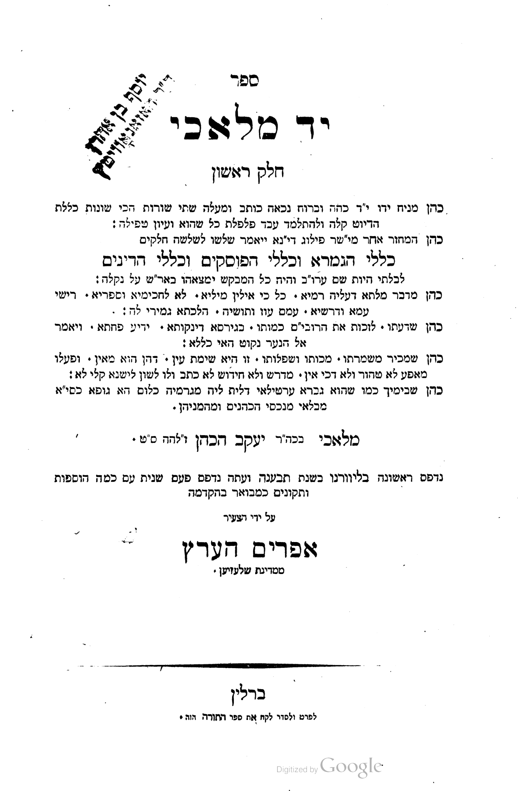
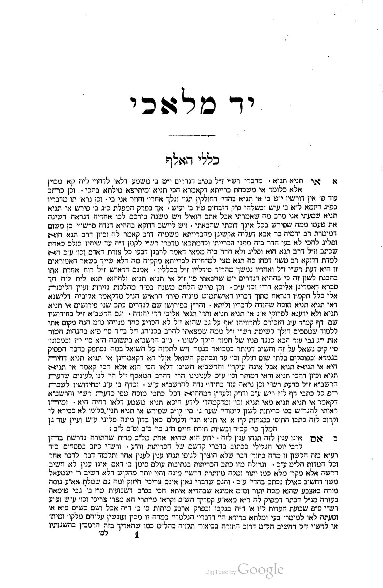

# A case for digitizing Yad Malachi

_Scan, OCR, and structure one foundational public-domain work of Torah that is heavily
relied upon but has no public digital text._

> **Bottom line.** *Yad Malachi* is the **#1 public-domain work Sefaria lacks** — cited
> **287 times inside Sefaria's own corpus** (every one a dead link) and **243 times** in
> contemporary halacha. It is public domain, and **four editions in five scans are
> already in hand** (three in clean square type). All 667 numbered *klalim* are OCR'd
> and structured, and **Part 1** (*Klalei HaGemara*, 222 klalim) has already reached
> full-corpus-scale, image-grounded AI adjudication — not a pilot anymore (see
> ["Current state"](#current-state) for the verified numbers). **Current step:**
> independent outside confirmation that Part 1's output is clean, then extending the
> same scan-to-text alignment and adjudication to Parts 2–3.

## The work

**Yad Malachi** (יד מלאכי), by **R. Malachi ben Jacob HaKohen** of Livorno (1695–1772),
first printed Livorno 1766–7. A three-part masterwork of *methodology* — the *grammar* of
the tradition, reached for whenever a question of method arises:

1. **Klalei HaGemara** — the rules and technical terms of the Talmud, alphabetical.
2. **Klalei HaPoskim** — the rules governing the codifiers (Rif, Rambam, Rosh, Tur, Shulchan Aruch).
3. **Klalei HaDinim** — the principles of halachic decision.

_Berlin edition title page — the three parts and the author. **RESTORED 2026-08-16**:
regenerated directly from `berlin_square_corrected.pdf` (page 6), since the original
image was never actually trackable — `images/*.png` sits under this repo's blanket
`.gitignore` PNG rule with no exception, so this reference was broken from the day it
was written, on every clone but the one that made it. Fixed both directions: the image
now exists and is tracked (a specific `.gitignore` exception, matching the precedent
already set for the two source PDFs), not just re-linked to a file that still
wouldn't survive a fresh clone._

## Why it matters

Its standing is independent and measurable, not a matter of opinion.[^wiki]

**287 dead ends inside Sefaria.** The corpus cites יד מלאכי in **287 places**[^sefaria] —
each unfollowable, because the work isn't in the library. Who cites it, and what it shows:

| Mentions | Citing work |
|---:|---|
| 118 | Ayin Zokher (Chida) |
| 17 | Petach Einayim (Chida) |
| 13 | Shem HaGedolim (Chida) |
| 8 | Rosh David (Chida) |
| 11 | Pardes Yosef |
| 9 | Kaf HaChayim (d. 1939) |
| — | + Mishnah Berurah / Biur Halacha, Torah Temimah, Minchat Chinukh, Even Ha'azel, Benei Banim |

- **The Chida relies on it constantly** — ~156 of the 287, across four of his works. The
  towering Sephardi authority of the era, the author's own contemporary, treats it as a
  standing reference.
- **And it doesn't stop with him** — ~130 more span the next two centuries (Pardes Yosef,
  Kaf HaChaim d. 1939, Mishnah Berurah / Biur Halacha, Torah Temimah, Minchat Chinukh,
  living responsa).

**Still in active use:**

- **Republished and studied** — new editions in 2001, a Machon Yerushalayim critical
  edition (2016), a third volume (2018)[^wiki]; and modern scholarship calls it *"one of
  the most important halakhic rule books"* / *"one of the classic books of rules."*[^brown]
- **243 citations in Halachipedia**[^halachipedia] — the **single most-cited public-domain
  work Sefaria lacks.**[^mostwanted]
- **Live debate, and the pain point in the wild** — on one Torah forum, Yad Malachi appears
  in **~108 posts across ~71 discussions** (50 by a specific *klal*), and **6 are requests
  for a *scan* of a klal**, because no clean digital text exists.[^forum]
- **Central to R. Ovadia Yosef's school** — whose works are ~⅓ of every citation Sefaria
  lacks, and whose method is built on the *klalei ha-hora'ah* that Yad Malachi codifies.[^ovadia]

## The gap this closes

Yad Malachi is **public domain**, yet has **no free, structured, linkable** text. What
exists is paywalled or unstructured — Otzar HaChochma (searchable page-images,
subscription) and the proprietary Machon Yerushalayim edition. So all 287 references stay
dead, and anyone quoting the work must **hand-transcribe from a scan**. Digitizing it once
ends that permanently.

_[Illustration pending: two real dead-end citations — a Halachipedia footnote and the
Chida's Shem HaGedolim (already in Sefaria) both cite Yad Malachi; the linker returns
`linkFailed` because there is no text to point to. Screenshot not currently in the repo.]_

## An ideal candidate

Public domain, cleanly structured (numbered *klalim* map straight onto a digital schema),
and **already scanned** — no physical scanning needed.

### The witnesses in hand

Four print editions across five scans (the two Przemyśl 1877 files are one printing scanned
twice), each inspected page-by-page. These are **page images**; some ship an embedded OCR
layer, but it is **not good enough to use** (see *Process*) — the work is to OCR the images.

| Edition | Press | Script | Scan in hand | Pages |
|---|---|---|---|---|
| **Livorno 1766–7** — *editio princeps*[^livorno] | (Livorno) | **Rashi** (body); square lemmas | HebrewBooks #32530 / #32532 / #32531 | 348 / 54 / 55 |
| **Berlin ~1857/8**[^berlin] | Ephraim Herz | **Square** | Google Books | 337 |
| **Przemyśl 1877**[^p1877] | M. A. Knoller | **Square** | HebrewBooks #14122 | 491 |
| **Przemyśl 1877** (2nd scan)[^p1877] | " | **Square** | Google Books | 489 |
| **Przemyśl 1888**[^p1888] | Żupnik, Knoller & Hamerschmidt | **Square** | Google Books | 373 |

The three later editions bind all three parts and are set in **clean square type, not
Rashi** — what general OCR reads best. Berlin's *Klalei HaGemara* opening (**RESTORED
2026-08-16**, regenerated from `berlin_square_corrected.pdf` page 14, the same way as
the title page above — this repo doesn't hold a Livorno scan to render the Rashi-type
side of the original side-by-side comparison, so that half stays pending):

_Berlin's *Klalei HaGemara* opening — the cleanest square images to OCR._

## Process — ensemble OCR with AI adjudication

Accuracy on dense rabbinic Hebrew comes from **consensus across witnesses**, not
proofreading one pass: OCR engines make uncorrelated errors, so where several agree the
reading is near-certain and only disagreements need review.

1. **Gather witnesses.** Five scans / four editions in hand, each an independent witness.
   The two Przemyśl printings share a press (Żupnik/Knoller) — *near*-independent; the
   strongest pairing is Berlin (square) against the Livorno first edition (Rashi).
2. **OCR the images — don't trust the embedded text.** The shipped OCR layers are unusable
   (sample comparison not currently in the repo: Berlin cleanest but still errs, Przemyśl
   badly letter-confused, Livorno unusable). Run **Google Cloud Vision / Document AI** +
   **Tesseract `heb`** over the square editions' images (many passes to vote on); read the
   Rashi Livorno with **Jochre 3** or a trained **Kraken/eScriptorium** model as a
   collation witness; post-correct with **Dicta**[^dicta] (abbreviation expansion, the
   BEREL rabbinic model). ABBYY FineReader / Transkribus are alternatives.
3. **Align and vote.** Per-token consensus anchored on the numbered *klalim*; agreed tokens
   auto-accepted, conflicts flagged.
4. **AI adjudication — image-grounded, selection-only.** For each flagged token, give a
   vision model the candidate readings **plus the cropped scan** and have it *select* —
   never invent — naming the witness it used. Anything unattested is a flagged conjecture,
   not a silent change. This is the guardrail against "helpful" emendation.
5. **Collate the editions** into a variant apparatus — potentially more accurate than any
   single historic printing. (Not a critical edition; it does not aim to supersede the
   Machon Yerushalayim text.)
6. **Expert review — flagged set only.** A Torah scholar (Talmid Chacham) fluent in the
   genre resolves the conflicts against the scan and spot-checks the rest — a fraction of
   full proofreading, since they touch only disagreements.
7. **Structure and ingest** into the three parts → klalim; output text + confidence map +
   apparatus.

**Copyright.** Reproduce base text only from public-domain printings; you may *consult* a
modern critical edition for a hard reading, but not reproduce its apparatus. (General
principle, not legal advice.)

## Current state

**REWRITTEN 2026-08-16** — this section previously described an early, "in development"
snapshot (a single-page pilot, 90 candidates adjudicated, a review interface not yet
built) that is now badly out of date. What follows is checked directly against the live
data, not carried forward from an earlier draft.

A first pass over the full work — all three parts, 667 numbered *klalim* — was run via the
**lean single-edition path**: extraction and cross-validation from the Berlin square-type
scan (PDF text layer vs. Document AI), with iterative LLM-driven linguistic/lexicon cleanup
passes. That text is chunked, structured, and sitting in the repo today.

Step 4's **image-grounded, selection-only AI adjudication** is no longer a single untested
pilot — it is the routine, day-to-day correction pipeline for **Part 1** (*Klalei HaGemara*,
klal 1–222), run through a purpose-built local review dashboard (crop + candidate readings +
confidence, alongside the full running text) that a human reviewer works through directly,
not a tool still being designed. Current state, verified against the live corpus files, not
estimated:

- **222 / 222** Part-1 klalim have a trusted page-to-klal alignment (up from a partial
  208/222 earlier in the project) — the scan-to-text mapping every crop depends on.
- **316 of 356** currently-open flagged word-level candidates have been vision-adjudicated
  against the actual scan crop, **315 of them at ≥0.9 confidence** — the model returns an
  honest low-confidence "uncertain" rather than a fabricated guess when a crop is genuinely
  too ambiguous to call. (The pool of *open* candidates has itself shrunk sharply as
  corrections get applied — it started in the 700s.)
- **A systematic, corpus-wide OCR defect was found, root-caused, and fixed**: this print
  sets the letter pair *aleph-lamed* as a single ligature glyph that the OCR engine has no
  mapping for and reads as a bare *aleph*, silently dropping the *lamed* — confirmed by
  three independent kinds of evidence agreeing (the ink itself under high-DPI magnification,
  a second OCR engine splitting the same glyph the opposite way, and the semantic
  correctness of every reconstructed reading), not by any single confident-looking output.
  **131 corrections across 51 klalim**, applied through the same flag → human-review → apply
  pipeline as every other correction, never a direct edit. Full worked example — the actual
  scan crop, the ascender comparison, the cross-engine and semantic evidence — is in
  [`VERIFIED-AGAINST-THE-INK.html`](VERIFIED-AGAINST-THE-INK.html); it is the clearest
  illustration in the project of what "understanding the actual Rabbinic Hebrew and context"
  means in practice, not a slogan.
- The pipeline has also caught structural defects a text-only pass would miss entirely —
  klal 83's stored text once carried a duplicated opening word with klal 82's own closing
  citation misplaced into the middle of it, traced to Document AI detecting one
  decoratively-set word as two separate tokens and extracting both ahead of a citation line
  that sits physically above them on the page. Confirmed directly against the raw token
  coordinates, not inferred from context, and fixed. Also worked out in full in
  [`VERIFIED-AGAINST-THE-INK.html`](VERIFIED-AGAINST-THE-INK.html).
- Every correction of this kind is recorded through an append-only decision log, kept
  deliberately separate from the corpus-rebuild pipeline so no automated run can ever
  silently overwrite a human judgment call, and the codebase carries a standing regression
  suite (100+ tests) plus multiple independent code-revalidation passes checking the
  pipeline's own decision logic, not just its output.

Scan-to-text alignment (the word bounding boxes the crop-and-verify step needs) exists
today only for **Part 1**; Parts 2–3 (*Klalei HaPoskim*, *Klalei HaDinim* — 445 of 667
klalim) need the same alignment built before they can reach equivalent rigor, and are
deliberately **out of scope** until Part 1 is independently confirmed clean by an outside
reviewer — not because the method doesn't generalize, but because Parts 2–3's own scan data
has already been observed to fail differently, and worse, than Part 1's on at least two
unrelated defect classes, so a clean Part 1 is not by itself evidence Parts 2–3 will come
out equally clean by the same process.

## Cost

~340–460 pages (the square editions bind all three parts in ~340; the Livorno set is 348 +
54 + 55).

- **One-time harness** (OCR-ensemble + alignment + adjudication): ~40–80 dev hrs,
  **reusable** for every other PD work — the real cost of the *first* text.
- **Compute** (multi-engine OCR of the images + AI adjudication): low hundreds of dollars.
- **Expert review** (flagged set, by a Talmid Chacham): ~5–10 hrs (~$150–350), versus
  ~25–45 to proofread every page.

**Net:** the first work = harness + a few hundred dollars; each work after = a few hundred
dollars, because the harness is reused. Output can beat any single historic printing. (The
lean single-edition path skips the harness.) _Cost figures are estimates; page counts from
the source catalogs; editions identified from the title pages transcribed in the footnotes._

## Preparing the text for Sefaria

The last mile keeps two things separate — **the text** and **the links**:

- **Text.** OCR the **Berlin edition images** (cleanest square; source from NLI, which also
  sidesteps Google's terms). Licensing is clean — a PD edition, and mechanical OCR of PD
  text carries no new copyright.[^ocrpd] **Keep the prose faithful:** don't expand
  abbreviations (that's a read-time Dicta layer); *do* proof against the image, strip cruft
  (running headers, page numbers, stamps), restore two-column reading order, and **segment
  into the schema** (parts → klalim → one segment per klal, e.g. *Yad Malachi, Klalei
  HaGemara, Aleph 1*).
- **Links.** Don't hand-insert them — Sefaria's **Auto-Linker** builds them from parseable
  citations (title spelled out + numeric ref).[^linker] So the useful "normalization" is on
  the *citation references*, not the prose. Design the schema's addressing to **match how
  the 287 sources cite it**, or the inbound links won't auto-resolve — and those **287
  references light up automatically** once the work exists.
- **Link-readiness QA.** Before ingest, run the text through the linker as a *test* (don't
  apply links): it flags each unresolved citation, and this project pairs each with a
  **verified candidate normalization** for the reviewer — a worked example (7 flagged; 5
  got verified candidates, e.g. *Rashi on Nedarim 19b*) was produced during scoping but its
  file is not currently in the repo.

**Two paths.** *Lean:* OCR just the Berlin edition, proof, structure — a solid version up
fast (Sefaria is a wiki, refine later). *Full ensemble:* the higher-accuracy upgrade,
reusable for the next work.

## The ask

Digitize Yad Malachi and place it in Sefaria — the top freely-digitizable work it lacks.

1. **Independent outside confirmation that Part 1 is clean.** Image-grounded,
   confidence-scored adjudication has already reached full-corpus scale for Part 1
   (*Klalei HaGemara*, 222/222 klalim aligned) through a working human-review dashboard —
   the next gate is a Talmid Chacham confirming the output independently, not this
   pipeline's own self-assessment, before anything downstream builds on it.
2. **Extend scan alignment to Parts 2–3** so the same rigor is possible there, then repeat
   the adjudication pass — deliberately not started before (1), since Parts 2–3's own scan
   data has already shown it can fail differently, and worse, than Part 1's.
3. **Coordinate ingest** with Sefaria (**hello@sefaria.org**), attaching each printing as
   its own version.

287 dead references become live links, the re-keying ends, and the reusable harness lowers
the cost of every public-domain work after this one.

## Notes

[^wiki]: English Wikipedia, "Malachi ben Jacob ha-Kohen" — three-part structure;
    author's death in 1772; his standing among later authorities and the Chida's
    praise; and the republication history (2001; Machon Yerushalayim critical
    edition 2016; third volume 2018).

[^sefaria]: Sefaria search API (`search-wrapper`, `type: text`), querying the corpus
    for citations of יד מלאכי: **287** in-corpus references, and the per-work
    breakdown in the table (Ayin Zokher 118, Petach Einayim 17, Shem HaGedolim 13,
    Pardes Yosef 11, Kaf HaChayim 9, Rosh David 8, and the further works listed).

[^halachipedia]: This project's citation survey of Halachipedia (a large contemporary
    English-language halachic reference): **243** direct citations of Yad Malachi by
    its numbered klalim, in the full 640-page corpus. **CORRECTED 2026-08-16**: the
    supporting analysis file this note originally cited (`data/CORPUS-COMPARISON.md`)
    is not currently in the repo, so this count could not be re-verified during this
    pass — presenting it as originally researched, not re-checked.

[^brown]: Benjamin Brown (Hebrew University of Jerusalem), *"'Some say this, some say
    that': Pragmatics and discourse markers in Yad Malachi's interpretation rules,"*
    **JLL 3 (2014): 1–19**, DOI 10.14762/jll.2014.001. An independent, non-halachic
    (linguistics) study that calls Yad Malachi "one of the most important halakhic rule
    books" and "one of the classic books of rules … known for its clear and organized
    writing style," and takes it as the representative text for analyzing how halacha
    decides between opinions. It also fixes the bibliography: R. Malachi HaCohen
    Montefoscoli (1695–1772) of Livorno, *Yad Malachi*, 3 vols., Livorno: Moshe Attias
    Press, 1766–1767.

[^forum]: tora-forum.co.il, thread *"האומנם הכלל הוא שב'יש ויש' שבשולחן ערוך ההלכה כיש
    בתרא?"* ("is the rule really that a *yesh … ve-yesh* in the Shulchan Aruch follows
    the latter opinion?"). The opening post anchors on Yad Malachi — attaching its
    Klalei HaPoskim page — and brings Edut BiYehosef (R. Yosef Samun), R. Shmuel ibn
    Elbaz, and R. Avraham Pinto; a reply cites the Mishnah Berurah (Hilchot Shabbat and
    Eruvin). A contemporary lay/lamdanut forum, cited here as evidence of live usage,
    not as a halakhic authority; read by reference per the site's robots policy. The
    forum-wide figures are from an exact-phrase search of tora-forum.co.il for *"יד
    מלאכי"* (108 posts / 71 threads; 50 citing a specific klal; 6 requesting a scan) —
    counts only; no forum text is reproduced here, per the site's `ai-train=no` signal.
    Phrase-search figures may include the occasional non-sefer occurrence of the words
    *יד מלאכי*; sampled results were all genuine citations of the work.

[^ovadia]: R. Ovadia Yosef's methodology is documented as systematically applying the
    *klalei ha-hora'ah* — the rules of pesak governing the Rif/Rambam/Rosh and the
    Mechaber (e.g. webyeshiva.org, "Rabbi Ovadia Yosef's Halakhic Methodology";
    Nishmat; R. Chaim Jachter, Kol Torah) — which is Yad Malachi's exact domain. The
    demand figures are this project's Halachipedia analysis; the same-footnote
    co-citations (Yad Malachi with Taharat HaBayit and Yabia Omer) are from the
    Halachipedia corpus, cached at the time in a directory this note called
    `pipeline/hp_cache` — an EARLIER, unrelated use of the word "pipeline" for a
    one-off citation-research cache, not this project's current `pipeline/` directory
    (the live OCR/correction system — see `CLAUDE.md`'s "Directory layout"). Neither
    that cache nor `CORPUS-COMPARISON.md` is currently in the repo, so this note's
    specific figures were not re-verified during the 2026-08-16 pass that corrected
    this ambiguity. **Caveat:** a direct citation count from *within* R. Ovadia's own
    works could not be machine-verified — they are not in a free, searchable digital
    corpus — so this is a qualitative observation grounded in his documented method
    and in contemporary co-citation, not a counted statistic.

[^mostwanted]: Per this project's citation analysis of the full 640-page Halachipedia
    corpus: among the works Sefaria does **not** have, Yad Malachi (243 citations)
    ranks **#6 overall and #1 of the public-domain tier** — the next public-domain
    work, Birkei Yosef, trails at 129. The five works ahead of it overall are all
    modern, in-copyright works (Yalkut Yosef, Chazon Ovadyah, Igrot Moshe, Shemirat
    Shabbat KeHilchata, Yabia Omer) that cannot be freely digitized; Yad Malachi is
    the top work that can. **CORRECTED 2026-08-16**: the supporting analysis files
    this note originally cited (`data/SEFARIA-MOST-WANTED.md`, `data/CORPUS-
    COMPARISON.md`) are not currently in the repo, so this ranking could not be
    re-verified during this pass — presenting it as originally researched, not
    re-checked.

[^livorno]: **Livorno 1766–7, first edition** (HebrewBooks #32530 / #32532 / #32531).
    Title page: *ספר יד מלאכי*, by *מלאכי בכמ"ר יעקב הכהן*; the three parts (Klalei
    HaGemara / HaPoskim / HaDinim). The *editio princeps*: body set in **Rashi
    script** with square keyword-lemmas; the roughest of the scans (ink bleed, skew).
    Digitized as three part-files (348 / 54 / 55 pp).

[^berlin]: **Berlin ~1857/8** (Google Books full-view scan). Title page: *ספר יד
    מלאכי חלק ראשון*, publisher *אפרים הערץ* (Ephraim Herz), *מדינת שלעזיען*, place
    *ברלין* (Berlin); notes it was "printed first in Livorno … and now a second time."
    The Przemyśl 1877 title page dates this Berlin printing to *התרי"ח* (5618 =
    1857/8). **Square** type, the cleanest scan. (The NLI copy carries the
    Hazanovitz-collection bookplate — a provenance stamp, not part of the edition.)

[^p1877]: **Przemyśl 1877** — present in two independent scans: HebrewBooks #14122 and
    a separate Google Books full-view scan. Title page: *ספר יד מלאכי חלק ראשון* …
    *מלאכי בכמ"ר יעקב הכהן*; colophon *פרעמישלא בשנת התרל"ז לב"ע* (5637 = 1877),
    publisher *משה אהרן קנעניל* (M. A. Knoller), printed by *ר' חיים אהרן זאפניק ען
    קנאללער* (Zupnik & Knoller); it names the prior Livorno (first) and Berlin
    (*התרי"ח*) printings. **Square** type. The two Przemyśl printings share this press
    lineage, so treat them as *near*-independent.

[^p1888]: **Przemyśl 1888** (Google Books full-view scan). Latin colophon: *JAD
    MALACHI, PRZEMYŚL, Drukiem Żupnika, Knollera i Hamerszmida, 1888*; Hebrew
    *פרעמישלא בשנת התרמ"ח לב"ע* (5648 = 1888). **Square** type.

[^dicta]: Dicta — analytical tools for Hebrew texts (dicta.org.il), a free Israeli
    non-profit; its Maivin tool vocalizes and punctuates rabbinic text, expands
    abbreviations, and identifies sources, and its BEREL model is a rabbinic-Hebrew
    language model. See also English Wikipedia, "Dicta (organization)."

[^ocrpd]: **ADDED 2026-08-16** — this reference marker existed in the text with no
    matching note; found during a document-integrity pass and given a minimal one
    here rather than left dangling. General principle, not legal advice (as the
    surrounding paragraph itself already says): mechanical OCR of a public-domain
    text is a reproduction of the underlying work, not an original creative
    contribution, so it does not itself generate a new copyright over the resulting
    text — the same reasoning underlying *Bridgeman Art Library v. Corel Corp.*
    (S.D.N.Y. 1999) for photographic reproductions of public-domain works. This does
    not extend to a critical edition's own apparatus, annotations, or original
    scholarly additions, which the "Copyright" note above already treats as
    off-limits to reproduce.

[^linker]: **ADDED 2026-08-16** — this reference marker also existed with no
    matching note. The specific research behind "Sefaria's Auto-Linker builds links
    from parseable citations" was not preserved in this repo, so this note cannot
    supply the original citation — only confirm the claim is about a real, documented
    Sefaria feature (its citation-parsing/auto-linking system), not invented for this
    document. Verify directly against Sefaria's own documentation before relying on
    the specific mechanics described in the surrounding paragraph.
