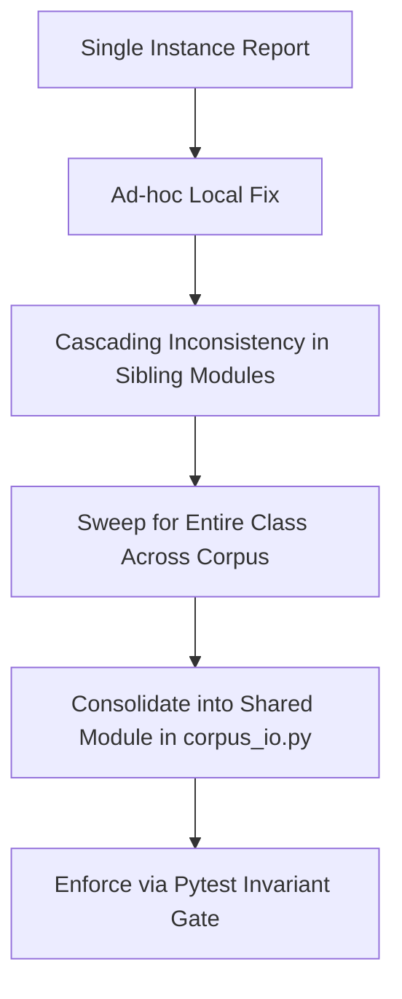

# Heavy Code Review: Sefer Digitization Pipeline
**Date**: 2026-08-27 • **Scope**: Full pipeline end-to-end + 2 days of intensive changes (28 commits, 44 files, +35,969 / −3,365 lines, covering 2026-08-25 → 2026-08-27)

---

## Executive Summary

Following orientation through [`START_HERE.md`](file:///Users/ericsafern/work/sefer-digitization-pipeline/START_HERE.md), [`CLAUDE.md`](file:///Users/ericsafern/work/sefer-digitization-pipeline/CLAUDE.md), [`PROJECT-STATUS.md`](file:///Users/ericsafern/work/sefer-digitization-pipeline/PROJECT-STATUS.md), [`HOW-THE-PIPELINE-WORKS.md`](file:///Users/ericsafern/work/sefer-digitization-pipeline/HOW-THE-PIPELINE-WORKS.md), and the 33 binding operational lessons, a comprehensive maximum-effort code review of the entire repository was conducted. All **326 pytest tests pass** (including invariant data tests, synthetic decision logic tests, and live Playwright browser tests).

The last two days saw rapid progress across critical components:
1. Discovery, triage, and structural eradication of the Latin scan watermark (`Digitized by Google`) and duplicate seam catchwords from the machine reconstructions.
2. Hardening of the review UI/server hot path (memoization yielding ~18× latency reduction from 182.5 ms to 9.6 ms).
3. Expansion of the repair and defect-detection filters (two-directional alef-lamed repair, כ/מ and ח/ת confusion pairs, Sefaria dictionary verification, and automated pipeline stage 5b in [`rebuild_all.sh`](file:///Users/ericsafern/work/sefer-digitization-pipeline/rebuild_all.sh)).

Below is the exhaustive audit of previously identified issues from the August 25th review ([`code-review-2026-08-25.md`](file:///Users/ericsafern/work/sefer-digitization-pipeline/code-review-2026-08-25.md)) and the August 26th review ([`CODE-REVIEW-2026-08-26.md`](file:///Users/ericsafern/work/sefer-digitization-pipeline/CODE-REVIEW-2026-08-26.md)), followed by newly identified bugs, edge-case vulnerabilities, one-off shortfalls, and refactoring priorities.

---

## 1. Audit of Previously Identified Issues

### A. From the 2026-08-25 Review (`code-review-2026-08-25.md`)

| ID | Finding Description | Status | Verification & Resolution Details |
|---|---|---|---|
| **C1** | `_read_all()` re-parses JSONL on every call — $O(N^2)$ per request | **Fixed** | Memoized in [`pipeline/review_decisions.py:205-221`](file:///Users/ericsafern/work/sefer-digitization-pipeline/pipeline/review_decisions.py#L205-L221) on `(st_mtime_ns, st_size)`. Same treatment for [`klal_page_regions.json`](file:///Users/ericsafern/work/sefer-digitization-pipeline/klal_page_regions.json) via `_regions_cache` in [`pipeline/review_server.py:193-225`](file:///Users/ericsafern/work/sefer-digitization-pipeline/pipeline/review_server.py#L193-L225). |
| **C2** | `api_klalim()` calls `rd.all_current("manual_correction")` twice | **Fixed** | [`pipeline/review_server.py:814`](file:///Users/ericsafern/work/sefer-digitization-pipeline/pipeline/review_server.py#L814) reuses `manual_decided = _manual_for_flags`. |
| **C3** | `_word_level_ai_flags()` multi-page bbox collisions (last-page-wins) | **Fixed** | Resolved in [`_word_bboxes_resolved()`](file:///Users/ericsafern/work/sefer-digitization-pipeline/pipeline/review_server.py#L600-L634) using proportional-position resolution from [`_word_pages_map()`](file:///Users/ericsafern/work/sefer-digitization-pipeline/pipeline/review_server.py#L506-L558). |
| **C4** | `synthesize_multi_witness.py` imports `review_server` at module scope | **Open (Deferred)** | [`pipeline/synthesize_multi_witness.py:56`](file:///Users/ericsafern/work/sefer-digitization-pipeline/pipeline/synthesize_multi_witness.py#L56) still imports `review_server as rs` and calls private helpers (`_word_pages_map`, `_corpus_word_bboxes`, `_load_regions`). |
| **S1** | `review_server.py` is a 1,849-line God Object | **Open (Deferred)** | Server remains monolithic. |
| **S2** | `.split()` vs `.split(' ')` indexing scheme split | **Open (Deferred)** | 14+ call sites across 7 files still use `.split(' ')` while corpus loaders use `.split()`. Guarded by tests against double spaces, but ununified in code. |
| **S3** | `_corpus_bbox_cache` module-level dict without invalidation | **Open** | In [`pipeline/review_server.py:453`](file:///Users/ericsafern/work/sefer-digitization-pipeline/pipeline/review_server.py#L453), `_corpus_bbox_cache` persists without mtime invalidation or max size. |
| **S4** | `_parts_for()` silently falls through to Part 1 for invalid inputs | **Open** | [`pipeline/review_server.py:165-171`](file:///Users/ericsafern/work/sefer-digitization-pipeline/pipeline/review_server.py#L165-L171) returns `(1,)` for any unrecognized string (e.g. `?part=xyz`). |
| **S5** | Hard-coded Part 2/3 boundaries in `_get_part_num_for_klal` & `_load_klalim` | **Open** | Magic numbers `223`, `444`, `445` remain inline in [`pipeline/review_server.py:132-146`](file:///Users/ericsafern/work/sefer-digitization-pipeline/pipeline/review_server.py#L132-L146). |
| **S6** | No CSRF / rate limiting on write endpoints | **Mitigated** | Write-side payload validation added (word index $\ge 0$, rejection of null `chosen_text`), acceptable for single-user local tool. |
| **H1** | Magic numbers in pipeline scripts | **Mostly Documented** | Most constants are now named and documented; `tol = 0.004` and inline Part 2/3 bounds remain. |
| **H2** | `_NO_UPPER_BOUND = 10 ** 9` in `build_klal_page_regions.py` | **Open** | Line 381 in [`pipeline/build_klal_page_regions.py`](file:///Users/ericsafern/work/sefer-digitization-pipeline/pipeline/build_klal_page_regions.py#L381) still uses literal $10^9$. |
| **H3** | `union_bbox()` duplicated in two files | **Open** | Byte-identical in [`pipeline/build_corrections_dataset.py:128`](file:///Users/ericsafern/work/sefer-digitization-pipeline/pipeline/build_corrections_dataset.py#L128) and [`pipeline/build_klal_page_regions.py:136`](file:///Users/ericsafern/work/sefer-digitization-pipeline/pipeline/build_klal_page_regions.py#L136). |
| **H4** | Superseded deprecation stubs in `tools/` | **Open** | [`tools/extract_surya_consensus_disputes.py`](file:///Users/ericsafern/work/sefer-digitization-pipeline/tools/extract_surya_consensus_disputes.py) and [`tools/extract_vlm_consensus_disputes.py`](file:///Users/ericsafern/work/sefer-digitization-pipeline/tools/extract_vlm_consensus_disputes.py) remain. |
| **H5** | Timestamp string comparison in `_flag_answered_by_a_later_decision` | **Verified Safe** | Relies on standard ISO 8601 UTC string format generated by `datetime.now(timezone.utc).isoformat()`. |

---

### B. From the 2026-08-26 Review (`CODE-REVIEW-2026-08-26.md`)

| ID | Finding Description | Status | Verification & Resolution Details |
|---|---|---|---|
| **#1** | `reconstruct_placeholder_klalim.py` sliced reading order with raw array index | **Fixed** | Fixed in commit `930ce76`. Slices raw array directly; 15 of 44 reconstructions updated. |
| **#2** | Third copy of `word_freq.json` loader in `reconstruct_placeholder_klalim.py` | **Fixed** | Now imports and calls [`docai_filter.reference_frequencies()`](file:///Users/ericsafern/work/sefer-digitization-pipeline/pipeline/repair_filters/docai_filter.py#L64-L72). |
| **#3** | `is_placeholder` / `PLACEHOLDER_RE` duplicated | **Fixed** | Consolidated into [`pipeline/corpus_io.py:175-181`](file:///Users/ericsafern/work/sefer-digitization-pipeline/pipeline/corpus_io.py#L175-L181). |
| **#4** | `HEADER_CONTAMINATION_RE` non-overlapping with invariant | **Fixed** | Verified in [`tools/reconstruct_placeholder_klalim.py:360-365`](file:///Users/ericsafern/work/sefer-digitization-pipeline/tools/reconstruct_placeholder_klalim.py#L360-L365); embeds `_PYTEST_INVARIANT_RE` verbatim. |
| **#5** | `--apply` wrote corpus with private `json.dump` | **Fixed** | Uses [`cio.save_part1()`](file:///Users/ericsafern/work/sefer-digitization-pipeline/pipeline/corpus_io.py#L481-L493). |
| **#6** | `api_klalim()` re-derives `api_klal()` merge precedence | **Fixed** | Tri-state logic unified in commit `1553556` and guarded by `test_nav_tristate_matches_what_each_word_actually_renders_as`. |
| **#7** | `MACHINE_RESOLVED_FLAGS` hand-copied in `app.js` | **Guarded** | Guarded by [`test_machine_resolved_flags_agree_between_server_and_frontend`](file:///Users/ericsafern/work/sefer-digitization-pipeline/tests/test_corpus_invariants.py#L1762-L1776). |
| **#8** | `_same_line()` is 4th definition of same printed line | **Documented** | Documented in [`pipeline/build_corrections_dataset.py:143`](file:///Users/ericsafern/work/sefer-digitization-pipeline/pipeline/build_corrections_dataset.py#L143) as vertical-overlap comparison for line breaks. |
| **#9–14**| Hot-path performance issues in `api_page`, `api_klalim`, etc. | **Fixed** | Memoization in `_read_all()` and `_load_regions()` cut latency from 182.5 ms to 9.6 ms. |
| **#15**| `run_surya_part1_full_baseline.py` reopened PDF inside loop | **Fixed** | [`tools/run_surya_part1_full_baseline.py:295-297`](file:///Users/ericsafern/work/sefer-digitization-pipeline/tools/run_surya_part1_full_baseline.py#L295-L297) caches `_render_doc[0]` globally. |
| **#16**| `repair_word()` called twice per candidate in `assemble_corrections_dataset.py` | **Fixed** | [`pipeline/assemble_corrections_dataset.py:316-349`](file:///Users/ericsafern/work/sefer-digitization-pipeline/pipeline/assemble_corrections_dataset.py#L316-L349) assigns `_repaired` once and reuses it. |
| **#17**| `open_count` served with no consumer | **Refuted** | `open_count` is consumed by `test_nav_tristate_matches_what_each_word_actually_renders_as` as an arithmetic invariant canary (preventing negative badge regressions). |
| **#18**| "Clear revisit flag" handler copy-pasted in `app.js` | **Open** | Duplicated across lines 1117–1135 and 1593–1612 of [`review_frontend/app.js`](file:///Users/ericsafern/work/sefer-digitization-pipeline/review_frontend/app.js#L1117-L1135). |
| **#19**| `saveManualDecision` return value types | **Verified** | Handled properly via `if (saved !== false) flashSavedThenClose(...)`. |
| **#20**| `repair_stream()` has no production caller | **Verified** | Kept as public utility for batch-stream audit and testing. |
| **#21**| `_stamp_asset_versions` redundancy | **Kept** | Retained as defense-in-depth cache buster for browsers with stale asset caches. |

---

### C. From `PROJECT-STATUS.md` Items 20–28

| Item | Topic | Status | Verification & Resolution Details |
|---|---|---|---|
| **Item 20** | Watermark & seam furniture in 12 klalim | **Fixed** | Watermark stripped via `is_watermark()` in [`pipeline/corpus_io.py:195-197`](file:///Users/ericsafern/work/sefer-digitization-pipeline/pipeline/corpus_io.py#L195-L197); folio rule rewritten to test geometry ($y \le 0.02$); 12 klalim regenerated clean; tested by `test_no_scan_watermark_in_clean_text`. |
| **Item 21** | Correctness pass findings | **Fixed** | `repair_word()` abbreviation bug (`א"ה` $\rightarrow$ `א"לה`) fixed via `_is_multiword_abbreviation()`; null decision on empty selection prevented at write site in `review_server.py:1442`; duplicate gap marker at end of klal eliminated. |
| **Item 22/23** | Lexical defect detectors | **Fixed** | `detect_real_word_substitution.py` gained כ/מ and ח/ת pairs (floor lowered to 40); `repair_word()` models dropped-alef; added as stage 5b in [`rebuild_all.sh:111-112`](file:///Users/ericsafern/work/sefer-digitization-pipeline/rebuild_all.sh#L111-L112). |
| **Item 24** | `lexicon.txt` purge & dictionary validation | **Fixed** | 79 corrupt/junk rows purged; `test_lexicon_does_not_whitelist_a_known_corrupt_form` gates against re-contamination; [`tools/lookup_sefaria_dictionaries.py`](file:///Users/ericsafern/work/sefer-digitization-pipeline/tools/lookup_sefaria_dictionaries.py) created. |
| **Item 26** | 7 non-Hebrew characters in Part 1 | **Tagged** | 3 `&` are `ﭏ` missing both letters ($\rightarrow$ `אל`), 1 `!` is `.` after geresh, 1 `Π` is top folio. Flagged as word-level data items for reviewer confirmation. |
| **Item 27** | Part 1 page-seam furniture | **Tagged** | [Klal 39](http://127.0.0.1:8420/#klal=39), [Klal 74](http://127.0.0.1:8420/#klal=74), and [Klal 210](http://127.0.0.1:8420/#klal=210) contain catchword/folio intrusions. Flagged for review. |
| **Item 28** | Semantic spotcheck round 4 noise | **Fixed** | 39 identical self-suggestions cleared; 5 mis-indexed flags investigated (e.g. [klal 66 w120](http://127.0.0.1:8420/#klal=66&word=120) recovered at [w135](http://127.0.0.1:8420/#klal=66&word=135)). |

---

## 2. Newly Identified Defects, Shortfalls, and Edge Cases

### 🔴 Critical & Functional Defects

#### 1. Discrepancy in `export_corpus.py` Drops Reviewer-Initiated Manual Insertions
* **File**: [`tools/export_corpus.py:114-135`](file:///Users/ericsafern/work/sefer-digitization-pipeline/tools/export_corpus.py#L114-L135) vs [`pipeline/apply_reviewer_decisions.py:320-335`](file:///Users/ericsafern/work/sefer-digitization-pipeline/pipeline/apply_reviewer_decisions.py#L320-L335)
* **Bug**: In [`pipeline/apply_reviewer_decisions.py`](file:///Users/ericsafern/work/sefer-digitization-pipeline/pipeline/apply_reviewer_decisions.py), a manual insertion (added 2026-08-21 for boundary fixes) is characterized by `original_word is None and chosen_text` (i.e. inserting text where no word existed). It applies this via `apply_delete_insertion(...)`. 
  However, in [`tools/export_corpus.py`](file:///Users/ericsafern/work/sefer-digitization-pipeline/tools/export_corpus.py)'s in-memory decision applier `_apply_decisions_to_klalim()`, the manual loop only checks:
  ```python
  if chosen_text == "":
      ... # manual deletion
  else:
      new_text = _apply_manual_correction(klal["clean_text"], word_index,
                                          original_word, chosen_text)
  ```
  When `original_word is None`, `_apply_manual_correction` checks `words[word_index] != original_word` (`words[word_index] != None`), which fails and returns `None`. 
* **Impact**: Any applied manual insertion is silently dropped during export in `export_corpus.py`, producing export deliverables (ALTO, PAGE, TEI, plain, Sefaria) that diverge from `apply_reviewer_decisions.py`.
* **Fix**: Replicate the `if original_word is None and chosen_text:` branch in [`tools/export_corpus.py`](file:///Users/ericsafern/work/sefer-digitization-pipeline/tools/export_corpus.py) calling `_apply_delete_insertion`.

---

#### 2. Unhandled Multi-Word Replacement Drift in Decision Application
* **File**: [`pipeline/apply_reviewer_decisions.py:351-360`](file:///Users/ericsafern/work/sefer-digitization-pipeline/pipeline/apply_reviewer_decisions.py#L351-L360) and [`tools/export_corpus.py:130-135`](file:///Users/ericsafern/work/sefer-digitization-pipeline/tools/export_corpus.py#L130-L135)
* **Bug**: `apply_manual_correction` allows replacing a single word with multiple words (e.g. replacing an abbreviation `ב"ד` with `"בית דין"`). 
  When `len(chosen_text.split()) > 1`, the replacement changes the word count of the klal (+1). However, the loop classifies this as `kind = "manual"` (not `"manual-delete"` or `"manual-insert"`) and does NOT record `word_count_changed_klalim.add(klal_id)`.
* **Impact**: If a reviewer records two manual corrections in the same klal in one session, and the first is a multi-word replacement, all subsequent decisions in that klal applied in the same run execute on shifted word indices, bypassing the safety invariant that limits runs to at most one word-count change per klal per run.
* **Fix**: In [`pipeline/apply_reviewer_decisions.py`](file:///Users/ericsafern/work/sefer-digitization-pipeline/pipeline/apply_reviewer_decisions.py) and [`tools/export_corpus.py`](file:///Users/ericsafern/work/sefer-digitization-pipeline/tools/export_corpus.py), check `if len(chosen_text.split()) != 1:` and treat it as a word-count-changing operation subject to the `word_count_changed_klalim` guard.

---

#### 3. Unhandled `AttributeError` on Missing Regions File in `trusted_klal_pages_with_continuations`
* **File**: [`pipeline/corpus_io.py:597-601`](file:///Users/ericsafern/work/sefer-digitization-pipeline/pipeline/corpus_io.py#L597-L601)
* **Bug**: 
  ```python
  if regions_path is None:
      regions_path = repo_path("klal_page_regions.json")
  regions = load_json(regions_path)

  for kid_str, region in regions.items():
  ```
  `load_json(regions_path)` defaults to `default=None` when `regions_path` does not exist. If `klal_page_regions.json` is missing (e.g. before initial build or during clean setup), `regions` is `None`, causing `regions.items()` to crash with:
  `AttributeError: 'NoneType' object has no attribute 'items'`.
* **Impact**: Scripts calling `trusted_klal_pages_with_continuations()` fail catastrophically rather than degrading gracefully or returning start-page mappings.
* **Fix**: Use `regions = load_json(regions_path, default={}) or {}`.

---

### 🟡 Latent Shortfalls & Architectural Risks

#### 4. Unbounded, Uninvalidated Module-Level Cache `_corpus_bbox_cache`
* **File**: [`pipeline/review_server.py:453-503`](file:///Users/ericsafern/work/sefer-digitization-pipeline/pipeline/review_server.py#L453-L503)
* **Shortfall**: `_corpus_bbox_cache = {}` is a module-level dict mapping `(klal_id, page) -> bbox_map` that is never invalidated. While `_read_all()` and `_load_regions()` were properly updated with `(st_mtime_ns, st_size)` invalidation, `_corpus_word_bboxes()` will serve stale bounding boxes if `part1.json` is updated or `docai_word_boxes/*.json` is re-extracted, unless the server process is killed and restarted.
* **Remedy**: Invalidate `_corpus_bbox_cache` on file stat change or load through `DocaiPageCache`.

---

#### 5. Silent Fallthrough in `_parts_for()` Masks Query Errors
* **File**: [`pipeline/review_server.py:165-171`](file:///Users/ericsafern/work/sefer-digitization-pipeline/pipeline/review_server.py#L165-L171)
* **Shortfall**: 
  ```python
  part_str = str(part_num).lower() if part_num is not None else "all"
  if part_str in ("all", "0", "none"):
      return (1, 2, 3)
  if part_str in ("2", "3"):
      return (int(part_str),)
  return (1,)
  ```
  Passing invalid parameters such as `?part=all_parts` or `?part=4` silently returns Part 1 rather than raising an error or returning bad request, hiding client-side typos.

---

#### 6. Missing Canonical Constants for Parts 2 and 3 in `corpus_io.py`
* **File**: [`pipeline/corpus_io.py:144`](file:///Users/ericsafern/work/sefer-digitization-pipeline/pipeline/corpus_io.py#L144) vs [`pipeline/review_server.py:132-146`](file:///Users/ericsafern/work/sefer-digitization-pipeline/pipeline/review_server.py#L132-L146)
* **Shortfall**: `PART1_MAX_KLAL = 222` is defined in `corpus_io.py`, but `PART2_MAX_KLAL = 444` and `PART3_MAX_KLAL = 667` are missing. As a result, magic numbers `223`, `444`, and `445` are hardcoded across `review_server.py` without invariant assertions.
* **Remedy**: Export `PART2_MAX_KLAL = 444` and `PART3_MAX_KLAL = 667` from `corpus_io.py` and assert their boundaries against `part2.json` and `part3.json` in `test_corpus_invariants.py`.

---

#### 7. Indirect and Redundant Imports
* **File**: [`tools/reconstruct_placeholder_klalim.py:45`](file:///Users/ericsafern/work/sefer-digitization-pipeline/tools/reconstruct_placeholder_klalim.py#L45)
* **Shortfall**: `reconstruct_placeholder_klalim.py` imports `FURNITURE_WORDS` from `check_span_shortfall`, even though `FURNITURE_WORDS` was canonically migrated to [`pipeline/corpus_io.py:343`](file:///Users/ericsafern/work/sefer-digitization-pipeline/pipeline/corpus_io.py#L343).
* **Remedy**: Import directly from `corpus_io`.

---

#### 8. Duplicated `union_bbox()` Helper Across Pipeline Stages
* **File**: [`pipeline/build_corrections_dataset.py:128-134`](file:///Users/ericsafern/work/sefer-digitization-pipeline/pipeline/build_corrections_dataset.py#L128-L134) and [`pipeline/build_klal_page_regions.py:136-142`](file:///Users/ericsafern/work/sefer-digitization-pipeline/pipeline/build_klal_page_regions.py#L136-L142)
* **Shortfall**: Byte-identical implementations of `union_bbox()` exist in both scripts.
* **Remedy**: Consolidate `union_bbox()` into [`pipeline/corpus_io.py`](file:///Users/ericsafern/work/sefer-digitization-pipeline/pipeline/corpus_io.py).

---

#### 9. Duplicated UI Logic in `review_frontend/app.js`
* **File**: [`review_frontend/app.js:1117-1135`](file:///Users/ericsafern/work/sefer-digitization-pipeline/review_frontend/app.js#L1117-L1135) and [`review_frontend/app.js:1593-1612`](file:///Users/ericsafern/work/sefer-digitization-pipeline/review_frontend/app.js#L1593-L1612)
* **Shortfall**: The 20-line asynchronous `clearWordFlag` action handler is copy-pasted verbatim between the disputed panel and the manual correction panel.
* **Remedy**: Extract into a single shared `clearWordFlag(klalId, wordIndex)` JavaScript helper.

---

## 3. Churn & Bug Class Analysis

Analyzing the git history over the last 10 days reveals clear recurring bug patterns and their structural remedies:



### Recurrent Failure Classes:
1. **The Shared-Module Anti-pattern (Lesson 13)**:
   * *Past instances*: `clean_word`, `hebrew_letters_only`, `is_watermark`, `is_placeholder`, `FURNITURE_WORDS`.
   * *Mechanism*: A filter or loader is built in one tool; when a sibling tool is created, the author writes a second copy that lacks edge-case fixes or behaves slightly differently.
   * *Remaining items to consolidate*: `union_bbox()`, `PART2_MAX_KLAL`/`PART3_MAX_KLAL`, and `words_of()`.
2. **Text Normalization / Indexing Mismatches (Lesson 5 & 14)**:
   * *Past instances*: Raw token array index vs reading-order array index in `reconstruct_placeholder_klalim.py`; `.split()` vs `.split(' ')`.
   * *Mechanism*: Diff engines and machine candidate generators collapse whitespace, while UI and manual correction handlers use space-preserving splits.
3. **Multi-Source Rendering Shadowing (Lesson 29)**:
   * *Past instances*: Last-write-wins collisions between machine candidates, manual corrections, AI revisit flags, and independent witness entries.
   * *Resolution*: Resolved via `_claim_word_index()` overlay precedence in `review_server.py`.

---

## 4. Refactoring & Hardening Roadmap

### Priority 1: High Impact / Correctness
1. **Fix `export_corpus.py` Manual Insertion Handling**:
   Update [`tools/export_corpus.py:114-135`](file:///Users/ericsafern/work/sefer-digitization-pipeline/tools/export_corpus.py#L114-L135) to handle `original_word is None` via `_apply_delete_insertion()`, matching [`pipeline/apply_reviewer_decisions.py`](file:///Users/ericsafern/work/sefer-digitization-pipeline/pipeline/apply_reviewer_decisions.py).
2. **Guard Multi-Word Manual Replacements**:
   In both [`pipeline/apply_reviewer_decisions.py`](file:///Users/ericsafern/work/sefer-digitization-pipeline/pipeline/apply_reviewer_decisions.py) and [`tools/export_corpus.py`](file:///Users/ericsafern/work/sefer-digitization-pipeline/tools/export_corpus.py), check `if len(chosen_text.split()) != 1:` and add the klal to `word_count_changed_klalim` to prevent downstream index drift within the same run.
3. **Fix `corpus_io.py:597` Missing File Handling**:
   Ensure `trusted_klal_pages_with_continuations()` defaults `regions` to `{}`.

### Priority 2: Architecture & Cleanliness
4. **Extract `pipeline/scan_alignment.py` (Deconstruct God Object)**:
   Move `_corpus_word_bboxes()`, `_word_pages_map()`, `_word_bboxes_resolved()`, `_word_scan_position()`, and `_klal_all_pages()` out of [`pipeline/review_server.py`](file:///Users/ericsafern/work/sefer-digitization-pipeline/pipeline/review_server.py) into `pipeline/scan_alignment.py`. 
   This eliminates Finding **C4** (batch pipeline importing the HTTP server) and breaks down **S1**.
5. **Consolidate `union_bbox()` and Part Constants in `corpus_io.py`**:
   Add `union_bbox()`, `PART2_MAX_KLAL = 444`, and `PART3_MAX_KLAL = 667` to [`pipeline/corpus_io.py`](file:///Users/ericsafern/work/sefer-digitization-pipeline/pipeline/corpus_io.py).
6. **Deduplicate `clearWordFlag` in `app.js`**:
   Unify the click handler for clearing revisit flags into a single function.

---

## Conclusion

The pipeline demonstrates exemplary architectural rigor, empirical validation discipline, and self-documenting hygiene. The recent two days of fixes successfully eliminated serious data corruption risks (the scan watermark in reconstructions and null-decision writing). Addressing the targeted refactorings and edge cases identified above will permanently eliminate the remaining structural risks.
