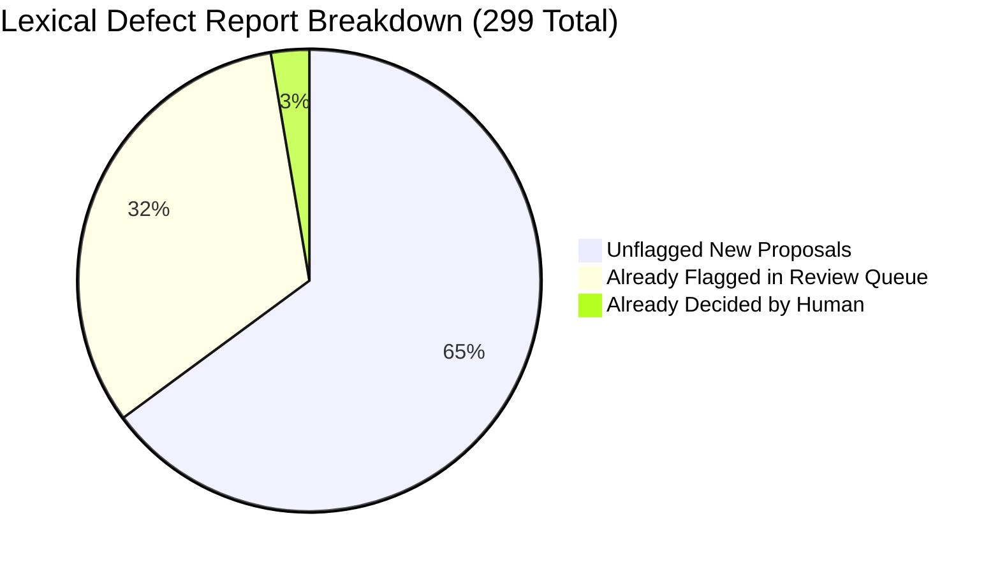
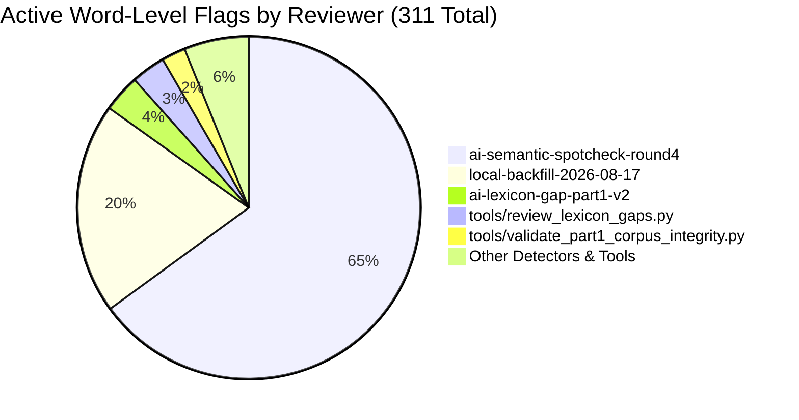

# Deep Audit: Lexical Defect Report & Open AI Revisit Flags
**Date**: 2026-08-27 • **Scope**: Read-only diagnostic analysis of [`lexical_defect_report.json`](file:///Users/ericsafern/work/sefer-digitization-pipeline/lexical_defect_report.json) (Stage 5b) and active word-level flags in [`review_decisions.jsonl`](file:///Users/ericsafern/work/sefer-digitization-pipeline/review_decisions.jsonl) / [`corrections_part1.json`](file:///Users/ericsafern/work/sefer-digitization-pipeline/corrections_part1.json).

---

## Part 1: Audit of the Lexical Defect Report (`lexical_defect_report.json`)

The newly automated Stage 5b generated **299 defect candidates** across **96 Part-1 klalim** (259 unambiguous single-candidate proposals, 40 ambiguous multi-proposal cases).

### 1. Confusion-Pair & Edit Distribution
* **Substitutions (138 total)**:
  * **$\text{ו} \leftrightarrow \text{י}$ (26 instances)**: The most frequent OCR confusion in this typeface.
  * **$\text{ב} \leftrightarrow \text{כ}$ (22 instances)**: Visual similarity (e.g. `גכי` $\rightarrow$ `גבי`, `הבכות` $\rightarrow$ `הבבות`).
  * **$\text{ד} \leftrightarrow \text{ה}$ (17 instances)**: Broken/fused leg (e.g. `בחרא` $\rightarrow$ `בחדא`).
  * **$\text{ה} \leftrightarrow \text{ר}$ (13 instances)**: Left leg drop (e.g. `עלירם` $\rightarrow$ `עליהם`, `יותה` $\rightarrow$ `יותר`).
  * **$\text{ר} \leftrightarrow \text{ת}$ (12 instances)**: Left stroke misread (e.g. `מתרר` $\rightarrow$ `מתרי`).
  * **$\text{ד} \leftrightarrow \text{ר}$ (11 instances)** & **$\text{ט} \leftrightarrow \text{מ}$ (11 instances)**: (e.g. `טיניה` $\rightarrow$ `מיניה`).
  * **$\text{ה} \leftrightarrow \text{ח}$ (10 instances)**, **$\text{ה} \leftrightarrow \text{ת}$ (9 instances)**, **$\text{ס} \leftrightarrow \text{פ}$ (6 instances)**, **$\text{כ} \leftrightarrow \text{מ}$ (4 instances)**, **$\text{ח} \leftrightarrow \text{ת}$ (4 instances)**.
* **Insertions & Deletions (161 total)**:
  * **Extra letter in stored text (171 proposals)**: Dropped duplicate glyphs, stray yods, or fused punctuation (e.g. `הלכרה` $\rightarrow$ `הלכה`, `אאביי` $\rightarrow$ `אביי`).
  * **Missing letter in stored text (21 proposals)**: Dropped root letters (e.g. `שרוא` $\rightarrow$ `שהוא`).

---

### 2. High-Confidence True Positives vs. False Alarms

Cross-referencing the **194 unflagged proposals** against the 6.18M-word reference corpus and surrounding sentence context illuminates the exact capabilities and limits of dictionary-frequency triage:

#### A. High-Confidence Genuine OCR Errors (True Positives)
These forms have zero independent attestation, while the proposal is attested thousands of times in Rabbinic literature:
1. [Klal 179 word 16](http://127.0.0.1:8420/#klal=179&word=16): `יותה` $\rightarrow$ `יותר` (*"...מוסיף ומדקדק בהבטה יותה מהרואה..."* — 3,326× attested; clear $\text{ה/ר}$ OCR error).
2. [Klal 30 word 250](http://127.0.0.1:8420/#klal=30&word=250) & [word 1263](http://127.0.0.1:8420/#klal=30&word=1263): `גכי` $\rightarrow$ `גבי` (*"...גכי יש יד לפאה..."* and *"...אבל גכי עדות..."* — 4,780× attested; clear $\text{כ/ב}$ OCR error).
3. [Klal 54 word 730](http://127.0.0.1:8420/#klal=54&word=730): `עלירם` $\rightarrow$ `עליהם` (*"...ולא דבר עלירם מטוב ועד רע..."* — 2,169× attested; clear $\text{ר/ה}$ OCR error).
4. [Klal 7 word 252](http://127.0.0.1:8420/#klal=7&word=252): `הלכרה` $\rightarrow$ `הלכה` (*"...ותמהני על עומק הלכרה של מהר"ש..."* — 2,290× attested; stray $\text{ר}$ insertion).
5. [Klal 168 word 162](http://127.0.0.1:8420/#klal=168&word=162): `אאביי` $\rightarrow$ `אביי` (*"...אאביי קי"ל כאביי..."* — 2,973× attested; duplicate $\text{א}$ insertion).
6. [Klal 30 word 1115](http://127.0.0.1:8420/#klal=30&word=1115): `טיניה` $\rightarrow$ `מיניה` (*"...לאסתיועי טיניה ע"ש ודון מינה..."* — 2,722× attested; $\text{ט/מ}$ OCR error).
7. [Klal 24 word 166](http://127.0.0.1:8420/#klal=24&word=166) & [word 230](http://127.0.0.1:8420/#klal=24&word=230): `ואידן` $\rightarrow$ `ואידך` (*"...איכא למעט לכש ואידן מכללא..."* — final-nun $\text{ן}$ misread for final-kaf $\text{ך}$).

#### B. Legitimate Corpus Forms (False Positives)
These forms prove why mechanical auto-replacement must never run without human eyes:
1. **Proper Nouns**: [Klal 30 word 1007](http://127.0.0.1:8420/#klal=30&word=1007): `זלמן` $\rightarrow$ `זמן` (*"...כה"רר משה שלמה זלמן ני'..."* — the detector stripped $\text{ל}$ from the name "Zalman").
2. **Halachic Technical Terms**: [Klal 2 word 188](http://127.0.0.1:8420/#klal=2&word=188) & [Klal 11 word 81](http://127.0.0.1:8420/#klal=11&word=81): `בשרש` $\rightarrow$ `בשר` (*"...בס' המצות בשרש השני..."* — the detector stripped $\text{ש}$ from "Shoresh" [root/principle] to yield "meat").
3. **Literary Vocabulary**: [Klal 123 word 24](http://127.0.0.1:8420/#klal=123&word=24): `תוהה` $\rightarrow$ `תורה` (*"...ואני תוהה מאד..."* — "wondering/astonished" proposed to become "Torah").
4. **Inflected Forms**: [Klal 169 word 982](http://127.0.0.1:8420/#klal=169&word=982): `במקורם` $\rightarrow$ `במקום` (*"...הרואה הדברים במקורם..."* — "in their source" proposed to become "in place of").
5. **Aramaic Verbs**: [Klal 167 word 1062](http://127.0.0.1:8420/#klal=167&word=1062): `אכחד` $\rightarrow$ `אחד` (*"...לא אכחד תחת לשוני..."* — "I shall not conceal" proposed to become "one").

---

## Part 2: Audit of Open AI Revisit Flags & Mis-Indexing (Round 4 Triage)

There are currently **455 active revisit flags** in [`review_decisions.jsonl`](file:///Users/ericsafern/work/sefer-digitization-pipeline/review_decisions.jsonl):
* **144 klal-level flags** (principally the 51 machine reconstructions flagged via [`tools/reconstruct_placeholder_klalim.py`](file:///Users/ericsafern/work/sefer-digitization-pipeline/tools/reconstruct_placeholder_klalim.py) + multi-page continuations).
* **311 word-level flags** across Part 1 (and 6 legacy Part-2 items).

### 1. `ai-semantic-spotcheck-round4` Flags (202 Total)
Parsing the structured notation (`target wNNN → proposed`) across all 202 flags reveals high index fidelity:
* **187 flags (92.6%) — Exact Match & Ready for Review**:
  * The word currently stored at `word_index` matches the flagged word exactly.
  * In the review dashboard, these render with one-click suggestion chips (`Use "..."`).
* **12 flags (5.9%) — Already Fixed in Corpus (Resolved Ghost Flags)**:
  * The current corpus text already contains the proposed reading:
    * [Klal 4 word 95](http://127.0.0.1:8420/#klal=4&word=95): current text is already `"כתבו"`
    * [Klal 88 word 510](http://127.0.0.1:8420/#klal=88&word=510): current text is already `"אבל"`
    * [Klal 88 word 533](http://127.0.0.1:8420/#klal=88&word=533): current text is already `"וכתבו"`
    * [Klal 88 word 880](http://127.0.0.1:8420/#klal=88&word=880): current text is already `"לכותי"`
    * [Klal 88 word 327](http://127.0.0.1:8420/#klal=88&word=327): current text is already `"וזה"`
    * [Klal 88 word 2](http://127.0.0.1:8420/#klal=88&word=2): current text is already `"ובאבל"`
    * [Klal 88 word 963](http://127.0.0.1:8420/#klal=88&word=963): current text is already `"ומתיר"`
    * [Klal 88 word 861](http://127.0.0.1:8420/#klal=88&word=861): current text is already `"כתיב"`
    * [Klal 2 word 30](http://127.0.0.1:8420/#klal=2&word=30): current text is already `"בפסחים"`
    * [Klal 167 word 22](http://127.0.0.1:8420/#klal=167&word=22): current text is already `"עמו"`
  * *Reason*: The reviewer fixed the word during manual reviews or script passes, but did not clear the historical `klal_flag` record.
* **1 flag (0.5%) — Drifted Index**:
  * [Klal 43 word 14](http://127.0.0.1:8420/#klal=43&word=14): Currently points to `"ומחתינן"`. The note targets `"ממטונא"` $\rightarrow$ `"מממונא"`, which sits at [Klal 43 word 17](http://127.0.0.1:8420/#klal=43&word=17) (shifted due to a 3-word insertion/geresh merge earlier in that klal).
* **1 flag (0.5%) — Out of Scope / Missing**:
  * [Klal 16 word 162](http://127.0.0.1:8420/#klal=16&word=162) target word was rewritten during truncation repair.

---

### 2. Remaining Word-Level Flags (109 Total)

| Reviewer / Tool | Count | Target Category & Findings |
|---|---|---|
| `local-backfill-2026-08-17` | 62 | Retroactive word-level anchors for multi-word phrases and disputed markers (e.g. [Klal 144 word 598](http://127.0.0.1:8420/#klal=144&word=598), [Klal 144 word 924](http://127.0.0.1:8420/#klal=144&word=924), [Klal 144 word 949](http://127.0.0.1:8420/#klal=144&word=949)). |
| `ai-lexicon-gap-part1-v2` | 11 | Rare forms with zero lexicon attestation (e.g. [Klal 1 word 229](http://127.0.0.1:8420/#klal=1&word=229) `דנראח`, [Klal 148 word 224](http://127.0.0.1:8420/#klal=148&word=224) `דמנילה`, [Klal 150 word 802](http://127.0.0.1:8420/#klal=150&word=802) `בתלמור`). |
| `tools/review_lexicon_gaps.py` | 10 | High-confidence lexicon-only corrupt forms purged on 2026-08-26 ([Klal 117 word 43](http://127.0.0.1:8420/#klal=117&word=43) `כרתב` $\rightarrow$ `כתב`, [Klal 152 word 98](http://127.0.0.1:8420/#klal=152&word=98) `בסרק` $\rightarrow$ `בפרק`, [Klal 169 word 1074](http://127.0.0.1:8420/#klal=169&word=1074) `שרוא` $\rightarrow$ `שהוא`). |
| `tools/validate_part1_corpus_integrity.py` | 7 | Non-Hebrew character intrusions ([Klal 39 word 252](http://127.0.0.1:8420/#klal=39&word=252) `Π` for folio, [Klal 69 word 338](http://127.0.0.1:8420/#klal=69&word=338) `&` for `ﭏ`, [Klal 77 word 11](http://127.0.0.1:8420/#klal=77&word=11) `&` for `ﭏ`). |
| `ai-pattern-b-sweep-incidental` | 6 | Part 2 legacy flags ([Klal 227 word 832](http://127.0.0.1:8420/#klal=227&word=832), [Klal 245 word 856](http://127.0.0.1:8420/#klal=245&word=856), [Klal 265 word 385](http://127.0.0.1:8420/#klal=265&word=385)) recorded before the Part 2/3 freeze; currently out of bounds for Part 1. |
| `ai-candidate-second-sort` | 4 | Unanimous 3-of-3 engine disagreements ([Klal 38 word 286](http://127.0.0.1:8420/#klal=38&word=286) `דרכה` $\rightarrow$ `דרבה`, [Klal 91 word 453](http://127.0.0.1:8420/#klal=91&word=453) `אליבא`, [Klal 91 word 524](http://127.0.0.1:8420/#klal=91&word=524) `אליבא`). |
| `tools/detect_real_word_substitution.py` | 4 | Real word substitution flags ([Klal 10 word 1](http://127.0.0.1:8420/#klal=10&word=1) `איידו` $\rightarrow$ `איידי`, [Klal 53 word 218](http://127.0.0.1:8420/#klal=53&word=218) `במשרו` $\rightarrow$ `במשהו`, [Klal 74 word 659](http://127.0.0.1:8420/#klal=74&word=659) `בסרק` $\rightarrow$ `בפרק`). |
| `tools/validate_catchword_continuity.py` | 2 | Seam furniture intrusions ([Klal 74 word 416](http://127.0.0.1:8420/#klal=74&word=416) `אמר`, [Klal 210 word 66](http://127.0.0.1:8420/#klal=210&word=66) `לא`). |
| `tools/lookup_sefaria_dictionaries.py` | 1 | [Klal 177 word 340](http://127.0.0.1:8420/#klal=177&word=340) `למיפך`: **Explicitly retracted** on 2026-08-26 after dictionary verification proved it valid, but flag record remains open. |
| `local` | 1 | [Klal 66 word 135](http://127.0.0.1:8420/#klal=66&word=135): Scan-confirmed ink correction (`ע"ס` $\rightarrow$ `ע"פ`). |

---

## Executive Takeaways

1. **Defect Report Value**: Stage 5b (`lexical_defect_report.json`) successfully surfaces high-value unflagged OCR errors (like `יותה` $\rightarrow$ `יותר`, `גכי` $\rightarrow$ `גבי`, `עלירם` $\rightarrow$ `עליהם`, `טיניה` $\rightarrow$ `מיניה`), while isolating known false-positive categories (proper names like `זלמן`, grammatical registers like `תוהה`).
2. **Review Queue Cleanliness**: **92.6%** of Round 4 flags are cleanly aligned and actionable in the UI. 12 flags are already satisfied in the text and 1 flag (`למיפך`) is retracted, representing 13 immediate candidates for flag clearing whenever review resumes.
3. **Index Stability**: Only 1 of 202 Round 4 flags experienced position drift ([Klal 43 word 14](http://127.0.0.1:8420/#klal=43&word=14) $\rightarrow$ [word 17](http://127.0.0.1:8420/#klal=43&word=17)), confirming that text index stability has remained high across the last two weeks of rebuilds.
