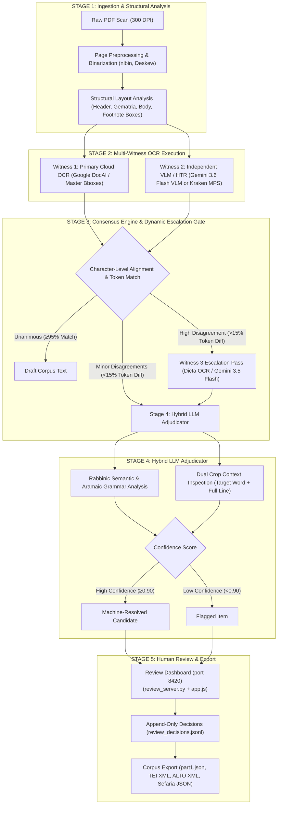

# Master Pipeline Architecture Specification: Rabbinic Sefer Digitization

---

## 1. Executive Summary & Core Design Philosophy

This document defines the master architecture for an autonomous, production-grade Rabbinic Sefer digitization pipeline. The pipeline transforms raw PDF scans of 19th/20th-century Rabbinic Hebrew/Aramaic printed books and manuscript commentaries into 100% verified, publication-grade digital text datasets.

### Core Architectural Directives
1. **Zero Circularity**: Primary OCR (Witness 1), Second Witness (Witness 2), and Adjudicator must remain strictly decoupled to avoid self-referential bias.
2. **Pluggable Provider Pattern**: All OCR engines, HTR tools, layout chunkers, and adjudicators implement Abstract Base Class (`ABC`) interfaces so components can be swapped with zero downstream code changes.
3. **Mandatory Incremental Persistence**: All worker scripts write and flush output item-by-item (`open(..., "a")`, `f.flush()`, `conn.commit()`) to prevent data loss from transient 503/429 cloud API failures.
4. **Spatial Bounding-Box Anchoring**: Primary OCR (Google Document AI) establishes the master spatial grid $[x_1, y_1, x_2, y_2]$; all witness overrides inherit this spatial grid for UI rendering.
5. **Character-Level Alignment**: Sequence alignment uses character-level Needleman-Wunsch with token projections to prevent sync-loss from word splits/merges.

---

## 2. 5-Stage End-to-End Pipeline Blueprint



---

## 3. Pluggable Interface Contracts (Provider Pattern)

```python
from abc import ABC, abstractmethod
from typing import List, Dict, Optional
from dataclasses import dataclass

@dataclass
class BoundingBox:
    x1: float
    y1: float
    x2: float
    y2: float

@dataclass
class OCRToken:
    text: str
    bbox: Optional[BoundingBox]
    confidence: float

@dataclass
class AdjudicationVerdict:
    chosen_text: str
    confidence: float
    reasoning: str
    source_witness: str

# 1. Structural Chunker Provider
class AbstractChunker(ABC):
    @abstractmethod
    def extract_regions(self, pdf_path: str, page_num: int) -> List[Dict]:
        """Extracts structural zones (headers, gematria, body text, footnotes)."""
        pass

# 2. Witness Engine Provider
class AbstractWitnessEngine(ABC):
    @abstractmethod
    def transcribe_region(self, pdf_path: str, page_num: int, bbox: BoundingBox) -> List[OCRToken]:
        """Transcribes region crop into tokens."""
        pass

# 3. Hybrid Adjudicator Provider
class AbstractAdjudicator(ABC):
    @abstractmethod
    def adjudicate(
        self,
        target_crop_bytes: bytes,
        line_crop_bytes: bytes,
        readings: Dict[str, str],
        context_sentence: str,
    ) -> AdjudicationVerdict:
        """Evaluates readings using Rabbinic semantics, Aramaic grammar, and dual crop images."""
        pass
```

---

## 4. Resolution of 4 Core Vulnerabilities

1. **Character-Level Needleman-Wunsch Alignment**: Prevents token-split/merge alignment cascading errors across paragraphs.
2. **Spatial Bounding-Box Anchoring**: All text overrides inherit Document AI's bounding box grid $[x_1, y_1, x_2, y_2]$ for UI rendering.
3. **Dual Crop Context Inspection**: Adjudicator receives both tight word crop AND full line image to prevent context blindness.
4. **Decoupled Prompt Versioning**: Cache keys in `adjudication_cache.db` use `prompt_version` (e.g. `"v1"`) to prevent prompt-edit cache invalidation storms.
