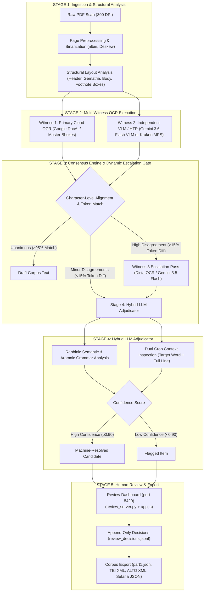

# Master Pipeline Architecture Specification: Rabbinic Sefer Digitization

---

## 1. Executive Summary & Core Design Philosophy

This document defines the master architecture for an autonomous, production-grade Rabbinic Sefer digitization pipeline. The pipeline transforms raw PDF scans of 19th/20th-century Rabbinic Hebrew/Aramaic printed books and manuscript commentaries into 100% verified, publication-grade digital text datasets.

### Core Architectural Directives
1. **Zero Circularity**: Primary OCR (Witness 1), Second Witness (Witness 2), and Adjudicator must remain strictly decoupled to avoid self-referential bias.
2. **Pluggable Provider Pattern**: All OCR engines, HTR tools, layout chunkers, and adjudicators implement Abstract Base Class (`ABC`) interfaces so components can be swapped with zero downstream code changes.
3. **Mandatory Incremental Persistence**: All worker scripts write and flush output item-by-item (`open(..., "a")`, `f.flush()`, `conn.commit()`) to prevent data loss from transient 503/429 cloud API failures.
4. **Spatial Bounding-Box Anchoring**: Primary OCR (Google Document AI) establishes the master spatial grid $[x_1, y_1, x_2, y_2]$; all witness overrides inherit this spatial grid for UI rendering.
5. **Character-Level Alignment**: Sequence alignment uses character-level Needleman-Wunsch with token projections to prevent sync-loss from word splits/merges.

---

## 2. 5-Stage End-to-End Pipeline Blueprint



---

## 3. Pluggable Interface Contracts (Provider Pattern)

```python
from abc import ABC, abstractmethod
from typing import List, Dict, Optional
from dataclasses import dataclass

@dataclass
class BoundingBox:
    x1: float
    y1: float
    x2: float
    y2: float

@dataclass
class OCRToken:
    text: str
    bbox: Optional[BoundingBox]
    confidence: float

@dataclass
class AdjudicationVerdict:
    chosen_text: str
    confidence: float
    reasoning: str
    source_witness: str

# 1. Structural Chunker Provider
class AbstractChunker(ABC):
    @abstractmethod
    def extract_regions(self, pdf_path: str, page_num: int) -> List[Dict]:
        """Extracts structural zones (headers, gematria, body text, footnotes)."""
        pass

# 2. Witness Engine Provider
class AbstractWitnessEngine(ABC):
    @abstractmethod
    def transcribe_region(self, pdf_path: str, page_num: int, bbox: BoundingBox) -> List[OCRToken]:
        """Transcribes region crop into tokens."""
        pass

# 3. Hybrid Adjudicator Provider
class AbstractAdjudicator(ABC):
    @abstractmethod
    def adjudicate(
        self,
        target_crop_bytes: bytes,
        line_crop_bytes: bytes,
        readings: Dict[str, str],
        context_sentence: str,
    ) -> AdjudicationVerdict:
        """Evaluates readings using Rabbinic semantics, Aramaic grammar, and dual crop images."""
        pass
```

---

## 4. Resolution of 4 Core Vulnerabilities

1. **Character-Level Needleman-Wunsch Alignment**: Prevents token-split/merge alignment cascading errors across paragraphs.
2. **Spatial Bounding-Box Anchoring**: All text overrides inherit Document AI's bounding box grid $[x_1, y_1, x_2, y_2]$ for UI rendering.
3. **Dual Crop Context Inspection**: Adjudicator receives both tight word crop AND full line image to prevent context blindness.
4. **Decoupled Prompt Versioning**: Cache keys in `adjudication_cache.db` use `prompt_version` (e.g. `"v1"`) to prevent prompt-edit cache invalidation storms.

---

## 5. Current Compliance Status vs. Directive #1 ("Zero Circularity") — 2026-08-20

**This section documents a real gap, found and discussed 2026-08-20, that
should have been written down when Witness 2 moved to `VlmWitnessEngine`.**
Directive #1 requires Witness 2 and the Adjudicator to be strictly decoupled.
As actually implemented, both call Gemini (`gemini-3.6-flash`/
`gemini-3.5-flash`) — `AbstractAdjudicator` above is a spec, never
implemented; the real, standing adjudicator is
`pipeline/verify_corrections_vision.py` via
`vision_adjudication_common.adjudicate_with_retry`, same model list as
`VlmWitnessEngine`.

**What partially mitigates this, confirmed by reading both prompts, not
assumed:**

- **Witness 2's task** (`vlm_witness.py`'s `PROMPT_TEMPLATE`) is deliberately
  blind, literal transcription: *"You are a literal OCR reader... Transcribe
  the Hebrew text visible in this image crop verbatim... Do not assume or
  infer text outside this image."* No sentence context, no semantic
  reasoning — the same task class as Witness 1 (DocAI), just a different
  implementation.
- **The Adjudicator's task** (`verify_corrections_vision.py`'s
  `PROMPT_TEMPLATE`) is categorically different: it receives the full
  surrounding sentence and is explicitly instructed to *"Perform Rabbinic
  acronym and semantic analysis using the surrounding sentence context"* and
  *"Recognize standard Rabbinic acronyms and abbreviations"* — a
  plausibility/context judgment, not a re-read of isolated pixels.
- So the two roles use **different inputs and different task framing**, which
  is genuine (if partial) diversity — not the same question asked twice. It
  is **not** full independence: both still run on the same underlying model
  family, so a systematic blind spot (a specific ligature, a rare glyph)
  could plausibly fool both roles identically. Per Lesson 9, this is weaker
  evidence than two independently-implemented engines agreeing.
- **Separately, and genuinely independently**: lexicon/corpus-attestation
  checking (`lexicon.txt`, `tools/review_lexicon_gaps.py`,
  `build_part1_freq.py`) is a real non-LLM, mechanical signal already in the
  pipeline (Lesson 8) — no model call at all, so no shared-model risk.
  Caveat: `lexicon.txt` itself was built from this corpus's own earlier OCR
  history, so it corroborates *plausibility/attestation*, not a fresh,
  independently-sourced reading — a different limitation than the
  same-model-twice issue above, not a fix for it.

**Still needed for full Directive #1 compliance: a third, genuinely
independent OCR/HTR engine**, either as an alternative Witness 2 or to give
the Adjudicator a real second transcription to arbitrate between, rather than
relying solely on same-model task-separation. Candidates evaluated so far
(`tools/second_witness_eval/README.md`):

- **Dicta OCR** — trained on Hebrew, reads Rashi script (DocAI's weakest
  area). Most promising, but **end-to-end raw-scan upload is still
  unconfirmed** (`PROJECT-STATUS.md` open item) — its web portal appears to
  be a `.docx`/`.txt` Dropbox-proofreading tool, not a confirmed raw-PDF-in
  pipeline. Not yet usable as a real second witness until this is resolved.
- **Kraken HTR** — the "blocked locally" status above was checked again
  2026-08-21 and **found stale**: it described an Intel/x86_64 wheel
  ceiling, but this machine is arm64 (Apple Silicon), where `kraken 3.0.13`
  and `torch 2.13.0` install and run without issue. Actually run
  (`tools/test_kraken_local.py`, plus a real pretrained Hebrew model,
  `Ashkenazi_01.mlmodel`, downloaded and run against
  `images/pdf_pages/page_18.png`) — real, readable Hebrew output with
  letter-level errors (`'יר מלאכי כללו האלף'` vs. the correct `'יד מלאכי
  כללי האלף'`), expected since that specific model is trained on medieval
  *handwriting*, not this printing's square type. Kraken itself is not the
  blocker; a print-typeface-matched model is what's missing.
- **HebrewBooks "fastocr"** — tested and rejected (44.0% lexicon hit vs. this
  corpus's 97.8%, systematic letter-confusion signature).
- **EasyOCR, PaddleOCR** — ruled out 2026-08-21, checked directly rather than
  assumed: EasyOCR's own `config.all_lang_list` does not contain `'he'`
  (confirmed by import and inspection, not documentation-reading); PaddleOCR
  confirmed via its own published language list to lack Hebrew entirely.
  Neither is a real candidate for this project.
- **Surya OCR** (`datalab-to/surya`, a separate company, not Google/Anthropic)
  — **the strongest finding to date, installed and run locally, real
  results, not a documentation claim.** Full-page OCR on
  `images/pdf_pages/page_18.png` produced an exact match on the running
  header (`'יד מלאכי כללי האלף'`) and near-exact klal 9 body text (minor
  noise only: `שכרתבו`/`שכתבו`, `ד"ה`/`דייה`). Most notably, **it correctly
  segmented klal 10's marker "י" as its own bold span** — the exact marker
  DocAI's own extraction failed to tokenize at all, independently
  root-caused the same day as the cause of a corpus-wide region-overlap bug
  affecting 316 klalim (`PROJECT-STATUS.md`, 2026-08-21). One page is not a
  benchmark — a proper multi-page Surya-vs-DocAI comparison (reusing
  `evaluate_ocr_alignment.py`'s existing method) is the concrete next step,
  not yet done — but this is the first candidate in this list with real,
  positive, tested evidence rather than an unconfirmed API or a blocked
  environment.
- **Claude vision** (the acting coding session's own image-reading
  capability, via the `Read` tool — not a new API integration) — already
  used successfully, live, on real data the same night this section was
  updated: directly rendering and reading `docai_word_boxes/page_19.json`'s
  disputed marker token and the surrounding scan crop correctly identified
  that DocAI had misread ט as פ (klal 16's marker, "טז" read as "פז") —
  a genuine letter-confusion Gemini-based tooling had not caught. Zero
  integration cost as an interactive, session-driven check; NOT
  batch-callable by a standalone script the way `VlmWitnessEngine`/
  `TesseractWitnessEngine` are, unless routed through the Anthropic API
  directly (no `ANTHROPIC_API_KEY` currently provisioned in this
  environment) rather than the coding session's own vision. Worth noting
  as the lowest-friction genuinely-independent signal available *right
  now*, distinct in kind from the batch-engine candidates above it.
- **Azure AI Document Intelligence** — confirmed via Microsoft's own
  documentation to support Hebrew in its Read model. The only candidate
  evaluated so far that would address circularity at the **primary OCR**
  level (DocAI itself), not just the witness/adjudicator level — a
  genuinely different company (Microsoft) from both Google and Anthropic.
  Not tested: would need a new Azure account/API key, not currently
  present in this environment. Feasible on paper, unverified in practice.
- **AWS Textract**, **OpenAI GPT-4V/GPT-4o** — not researched in depth as of
  2026-08-21; flagged as open, not ruled out.

Until one of these (or another candidate) is actually WIRED IN as a running
pipeline component — not just installed and spot-tested — treat Parts 2-3
vision-adjudicated output as carrying same-model correlated-error risk, not
full two-engine independence — do not describe it as "$\ge 0.90$ confidence,
image-grounded, independently verified" without this caveat. **Recommended
next step, ranked by (feasibility right now) × (real independence gained)**:
(1) a proper multi-page Surya benchmark, given it already outperformed DocAI
on the one real comparison run; (2) Claude vision via the Anthropic API as a
batch-callable witness or adjudicator cross-check, given it already caught a
real DocAI error the standing pipeline missed; (3) Azure AI Document
Intelligence as an alternative primary-OCR source, the only option here that
would fix circularity at that specific level.
